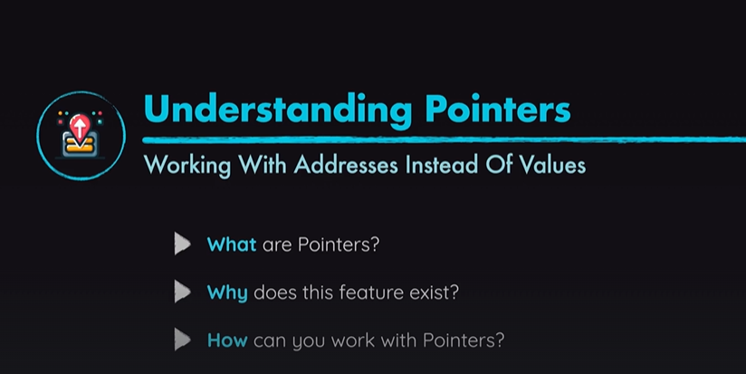
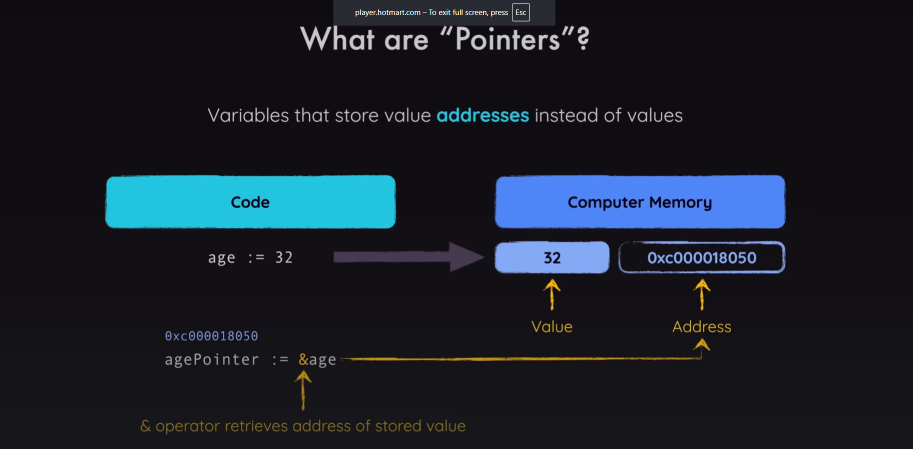
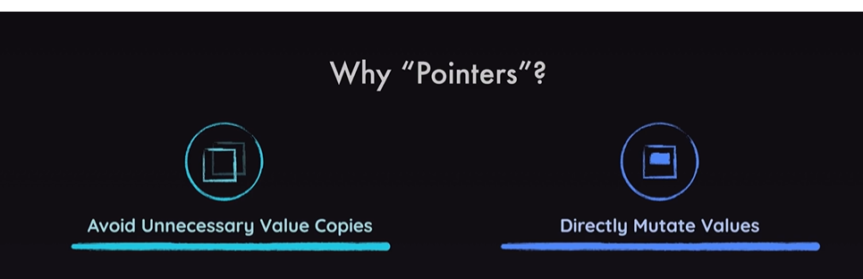
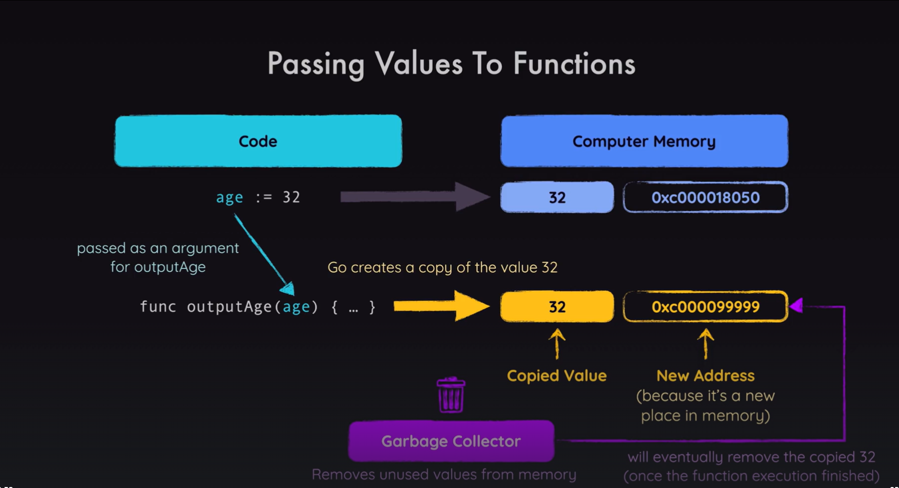
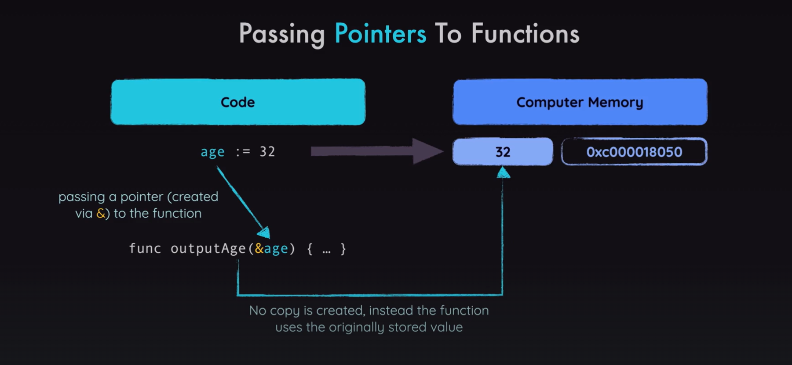
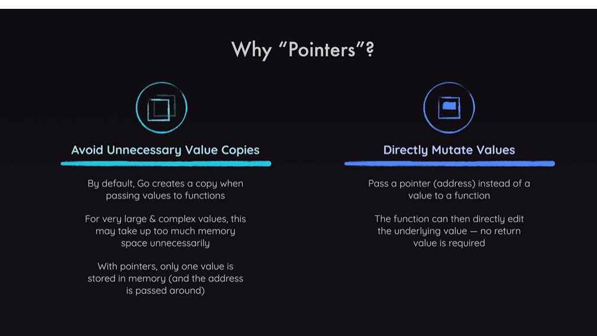

All values in Go have a so-called "Null Value" - i.e., the value that's set as a default if no value is assigned to a variable.

For example, the null value of an int variable is 0. Of a float64, it would be 0.0. Of a string, it's "".

For a pointer, it's nil - a special value built-into Go.

nil represents the absence of an address value - i.e., a pointer pointing at no address / no value in memory.