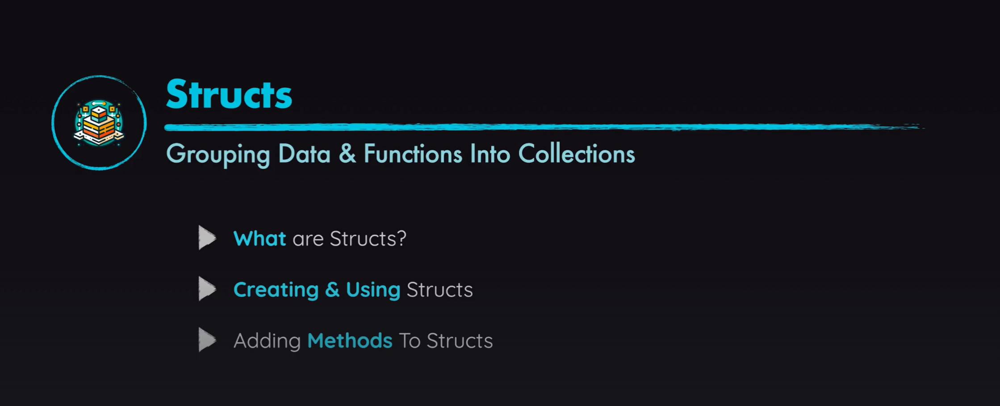

# Go Structs and Custom Types



## What are Structs in Go?

Structs in Go are custom data types that allow you to group related data into a single unit. They're similar to classes in object-oriented programming languages but with some key differences.

## When to Use Structs

- When you need to group related data together
- When you want to create reusable, logical units of data
- When you need to attach methods to your data
- When representing real-world entities (users, products, etc.)

## Defining a Struct

```go
type User struct {
    FirstName string
    LastName  string
    BirthDate string
    createdAt time.Time  // Lowercase fields are private to the package
}
```

## Creating Struct Instances

### Direct Initialization

```go
user := User{
    FirstName: "John",
    LastName:  "Doe",
    BirthDate: "01/01/1990",
    createdAt: time.Now(),
}
```

### Using Constructor Functions

Constructor functions provide a clean way to create struct instances with proper initialization:

```go
func newUser(firstName, lastName, birthDate string) *User {
    return &User{
        FirstName: firstName,
        LastName:  lastName,
        BirthDate: birthDate,
        createdAt: time.Now(),
    }
}

// Usage
newUser := newUser("John", "Doe", "01/01/1990")
```

## Methods on Structs

### Value Receivers (Copy)

Methods with value receivers operate on a copy of the struct:

```go
func (user User) printUserInfo() {
    fmt.Println("User Information:")
    fmt.Println("First Name:", user.FirstName)
    // ...
}
```

### Pointer Receivers (Reference)

Methods with pointer receivers can modify the original struct:

```go
func (user *User) updateLastName(newLastName string) {
    user.LastName = newLastName
}
```

## Key Concepts

1. **Public vs Private Fields**: Fields starting with uppercase letters are exported (public), while lowercase fields are package-private.

2. **Value vs Pointer Receivers**: 
   - Use value receivers for methods that don't modify the struct
   - Use pointer receivers for methods that need to modify the struct or for large structs to avoid copying

3. **Constructor Functions**: Create functions that properly initialize your structs with any default values.

## Best Practices

1. Use structs to model related data that naturally belongs together
2. Use pointer receivers for methods that modify the struct
3. Use value receivers for methods that only read from the struct
4. Create constructor functions for complex initialization logic
5. Follow Go's naming conventions (PascalCase for exported, camelCase for unexported)
