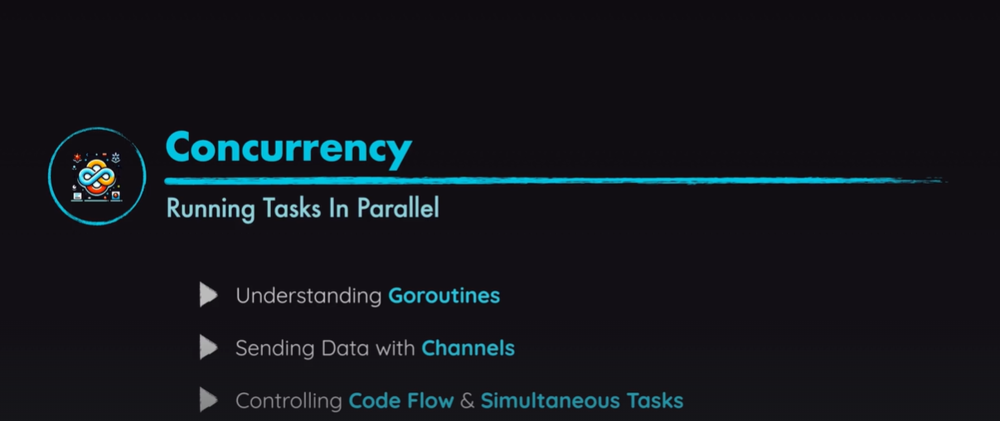

# Go Concurrency - Running Tasks In Parallel



## The Goroutine Problem

When you use the `go` keyword in Go, you're creating **goroutines** - lightweight threads that run concurrently. However, the main issue with using `go` alone is that the **main goroutine terminates immediately** before the other goroutines have a chance to execute and print their output.

### What happens in the current code:

```go
func main() {
    go greet("Nice to meet you!")
    go greet("How are you?")
    go slowGreet("How ... are ... you ...?")
    go greet("I hope you're liking the course!")
    // Main function ends immediately here!
}
```

**Timeline of execution:**
1. `main()` function starts (this is the main goroutine)
2. Four goroutines are launched with `go` keyword
3. **Main goroutine reaches the end of `main()` function immediately**
4. When main goroutine exits, **all other goroutines are terminated** regardless of their state
5. Program exits before any goroutine can print anything

### Visual representation:

```
Timeline:
Main goroutine:    [start] -> [launch 4 goroutines] -> [end] -> PROGRAM EXITS
Goroutine 1:       [start] -> [trying to print...] -> KILLED
Goroutine 2:       [start] -> [trying to print...] -> KILLED  
Goroutine 3:       [start] -> [sleeping 3s...] -> KILLED
Goroutine 4:       [start] -> [trying to print...] -> KILLED
```

## Solutions

### Solution 1: Using `time.Sleep()` (Simple but not ideal)

```go
package main

import (
    "fmt"
    "time"
)

func greet(phrase string) {
    fmt.Println("Hello!", phrase)
}

func slowGreet(phrase string) {
    time.Sleep(3 * time.Second)
    fmt.Println("Hello!", phrase)
}

func main() {
    go greet("Nice to meet you!")
    go greet("How are you?")
    go slowGreet("How ... are ... you ...?")
    go greet("I hope you're liking the course!")
    
    // Wait for goroutines to finish
    time.Sleep(4 * time.Second) // Wait longer than the slowest goroutine
}
```

**Pros:** Simple to implement
**Cons:** You need to guess how long to wait, inefficient, not reliable

### Solution 2: Using `sync.WaitGroup` (Recommended)

```go
package main

import (
    "fmt"
    "sync"
    "time"
)

func greet(phrase string, wg *sync.WaitGroup) {
    defer wg.Done() // Mark this goroutine as done when function exits
    fmt.Println("Hello!", phrase)
}

func slowGreet(phrase string, wg *sync.WaitGroup) {
    defer wg.Done() // Mark this goroutine as done when function exits
    time.Sleep(3 * time.Second)
    fmt.Println("Hello!", phrase)
}

func main() {
    var wg sync.WaitGroup
    
    // Tell WaitGroup we're waiting for 4 goroutines
    wg.Add(4)
    
    go greet("Nice to meet you!", &wg)
    go greet("How are you?", &wg)
    go slowGreet("How ... are ... you ...?", &wg)
    go greet("I hope you're liking the course!", &wg)
    
    // Wait for all goroutines to finish
    wg.Wait()
    fmt.Println("All goroutines completed!")
}
```

**How WaitGroup works:**
- `wg.Add(n)`: Tell WaitGroup to wait for n goroutines
- `wg.Done()`: Mark one goroutine as completed (decrements counter)
- `wg.Wait()`: Block until all goroutines call `Done()` (counter reaches 0)

### Solution 3: Using Channels

```go
package main

import (
    "fmt"
    "time"
)

func greet(phrase string, done chan bool) {
    fmt.Println("Hello!", phrase)
    done <- true // Send signal that this goroutine is done
}

func slowGreet(phrase string, done chan bool) {
    time.Sleep(3 * time.Second)
    fmt.Println("Hello!", phrase)
    done <- true // Send signal that this goroutine is done
}

func main() {
    done := make(chan bool, 4) // Buffered channel for 4 goroutines
    
    go greet("Nice to meet you!", done)
    go greet("How are you?", done)
    go slowGreet("How ... are ... you ...?", done)
    go greet("I hope you're liking the course!", done)
    
    // Wait for all 4 goroutines to complete
    for i := 0; i < 4; i++ {
        <-done // Receive from channel (blocks until message received)
    }
    
    fmt.Println("All goroutines completed!")
}
```

**How Channels work:**
- `make(chan bool, 4)`: Create a buffered channel that can hold 4 boolean values
- `done <- true`: Send a value to the channel (non-blocking with buffered channel)
- `<-done`: Receive from channel (blocks until a value is available)

## Key Concepts

### 1. Main Goroutine Lifecycle
- When `main()` function ends, the entire program terminates
- All other goroutines are forcefully stopped
- This is why you need to wait for goroutines to complete

### 2. Goroutines vs Threads
- Goroutines are much lighter than OS threads
- Thousands of goroutines can run on just a few OS threads
- Go runtime manages goroutine scheduling

### 3. Concurrency vs Parallelism
- **Concurrency**: Dealing with multiple things at once (composition)
- **Parallelism**: Doing multiple things at once (execution)
- Goroutines provide concurrency; actual parallelism depends on CPU cores

## Expected Output (with any synchronization solution):

```
Hello! Nice to meet you!
Hello! How are you?
Hello! I hope you're liking the course!
Hello! How ... are ... you ...?  // This appears after 3 seconds
All goroutines completed!
```

## Best Practices

1. **Use WaitGroup** for simple "wait for all to complete" scenarios
2. **Use Channels** when you need communication between goroutines
3. **Always synchronize** - never rely on `time.Sleep()` in production code
4. **Handle errors properly** - goroutines should report errors back to main
5. **Use context** for cancellation and timeouts in complex scenarios

## Running the Code

To test the original problem:
```bash
go run main.go
```
(You'll see no output because goroutines are killed immediately)

To test with solutions, replace the code with any of the solution implementations above.


// ...existing code...

## Deep Dive: Understanding Channels

Channels are Go's way of allowing goroutines to **communicate safely** and **synchronize their execution**. Think of channels as **pipes** through which goroutines can send and receive data.

### What are Channels?

Channels are **typed conduits** through which you can send and receive values with the channel operator `<-`.

```go
ch <- v    // Send v to channel ch
v := <-ch  // Receive from ch, and assign value to v
```

### Basic Channel Syntax

```go
// Creating channels
ch := make(chan int)        // Unbuffered channel of integers
ch := make(chan string, 5)  // Buffered channel of strings with capacity 5

// Sending to a channel
ch <- 42                    // Send the value 42 to channel ch

// Receiving from a channel
value := <-ch               // Receive a value from ch and store in 'value'
<-ch                        // Receive and discard the value
```

### Types of Channels

#### 1. Unbuffered Channels (Synchronous)

```go
package main

import "fmt"

func main() {
    ch := make(chan string) // Unbuffered channel
    
    go func() {
        ch <- "Hello from goroutine!" // Send
    }()
    
    message := <-ch // Receive (blocks until someone sends)
    fmt.Println(message)
}
```

**Key Points:**
- **Synchronous**: Send and receive happen at the same time
- **Blocking**: Sender blocks until receiver is ready, and vice versa
- **Direct handoff**: No storage, direct communication

#### 2. Buffered Channels (Asynchronous)

```go
package main

import "fmt"

func main() {
    ch := make(chan string, 2) // Buffered channel with capacity 2
    
    // These sends don't block because buffer has space
    ch <- "First message"
    ch <- "Second message"
    
    // Now buffer is full, this would block:
    // ch <- "Third message" // This would block!
    
    // Receive messages
    fmt.Println(<-ch) // "First message"
    fmt.Println(<-ch) // "Second message"
}
```

**Key Points:**
- **Asynchronous**: Sender doesn't wait if buffer has space
- **Capacity**: Can store values up to buffer size
- **Blocks when full**: Sender blocks when buffer is full
- **Blocks when empty**: Receiver blocks when buffer is empty

### Channel Directions

You can restrict channels to only send or only receive:

```go
// Send-only channel
func sender(ch chan<- string) {
    ch <- "Hello"
    // ch <- "World" // OK
    // msg := <-ch   // ERROR! Cannot receive from send-only channel
}

// Receive-only channel
func receiver(ch <-chan string) {
    msg := <-ch
    fmt.Println(msg)
    // ch <- "Hello" // ERROR! Cannot send to receive-only channel
}

func main() {
    ch := make(chan string)
    
    go sender(ch)
    go receiver(ch)
    
    // Keep main alive
    time.Sleep(time.Second)
}
```

### Practical Examples

#### Example 1: Simple Communication

```go
package main

import (
    "fmt"
    "time"
)

func worker(id int, jobs <-chan int, results chan<- int) {
    for job := range jobs {
        fmt.Printf("Worker %d processing job %d\n", id, job)
        time.Sleep(time.Second) // Simulate work
        results <- job * 2      // Send result
    }
}

func main() {
    jobs := make(chan int, 5)
    results := make(chan int, 5)
    
    // Start 2 workers
    go worker(1, jobs, results)
    go worker(2, jobs, results)
    
    // Send jobs
    for i := 1; i <= 5; i++ {
        jobs <- i
    }
    close(jobs) // Important! Close channel when done sending
    
    // Collect results
    for i := 1; i <= 5; i++ {
        result := <-results
        fmt.Printf("Result: %d\n", result)
    }
}
```

#### Example 2: Channel as a Signal (Like our greeting example)

```go
package main

import (
    "fmt"
    "time"
)

func greet(phrase string, done chan<- bool) {
    fmt.Println("Hello!", phrase)
    done <- true // Signal that this goroutine is finished
}

func slowGreet(phrase string, done chan<- bool) {
    time.Sleep(3 * time.Second)
    fmt.Println("Hello!", phrase)
    done <- true // Signal completion
}

func main() {
    done := make(chan bool, 4) // Buffered channel for 4 signals
    
    go greet("Nice to meet you!", done)
    go greet("How are you?", done)
    go slowGreet("How ... are ... you ...?", done)
    go greet("I hope you're liking the course!", done)
    
    // Wait for all 4 completion signals
    for i := 0; i < 4; i++ {
        <-done // Block until we receive a signal
        fmt.Printf("Goroutine %d completed\n", i+1)
    }
    
    fmt.Println("All goroutines finished!")
}
```

### Channel Operations

#### Closing Channels

```go
ch := make(chan int)
close(ch) // Close the channel

// Check if channel is closed
value, ok := <-ch
if !ok {
    fmt.Println("Channel is closed")
}

// Range over channel (automatically stops when closed)
for value := range ch {
    fmt.Println(value)
}
```

#### Select Statement (Channel Multiplexing)

```go
package main

import (
    "fmt"
    "time"
)

func main() {
    ch1 := make(chan string)
    ch2 := make(chan string)
    
    go func() {
        time.Sleep(2 * time.Second)
        ch1 <- "Message from channel 1"
    }()
    
    go func() {
        time.Sleep(1 * time.Second)
        ch2 <- "Message from channel 2"
    }()
    
    // Select waits for the first available channel
    for i := 0; i < 2; i++ {
        select {
        case msg1 := <-ch1:
            fmt.Println("Received:", msg1)
        case msg2 := <-ch2:
            fmt.Println("Received:", msg2)
        case <-time.After(3 * time.Second):
            fmt.Println("Timeout!")
            return
        }
    }
}
```

### Common Channel Patterns

#### 1. Fan-out (Distribute work)

```go
func fanOut(input <-chan int, workers int) []<-chan int {
    outputs := make([]<-chan int, workers)
    
    for i := 0; i < workers; i++ {
        output := make(chan int)
        outputs[i] = output
        
        go func(out chan<- int) {
            for n := range input {
                out <- n * n // Square the number
            }
            close(out)
        }(output)
    }
    
    return outputs
}
```

#### 2. Fan-in (Combine results)

```go
func fanIn(inputs ...<-chan int) <-chan int {
    output := make(chan int)
    
    for _, input := range inputs {
        go func(in <-chan int) {
            for value := range in {
                output <- value
            }
        }(input)
    }
    
    return output
}
```

### Channel vs WaitGroup: When to Use What?

| Use Case | Channel | WaitGroup |
|----------|---------|-----------|
| **Simple synchronization** | ❌ | ✅ |
| **Data communication** | ✅ | ❌ |
| **Result collection** | ✅ | ❌ |
| **Error handling** | ✅ | ❌ |
| **Complex coordination** | ✅ | ❌ |
| **Just "wait for completion"** | ❌ | ✅ |

### Common Pitfalls

#### 1. Deadlock with Unbuffered Channels

```go
// DEADLOCK! Don't do this:
func badExample() {
    ch := make(chan int)
    ch <- 42 // This blocks forever because no one is receiving
    fmt.Println(<-ch)
}

// Fixed version:
func goodExample() {
    ch := make(chan int, 1) // Buffered channel
    ch <- 42
    fmt.Println(<-ch)
}
```

#### 2. Forgetting to Close Channels

```go
// Can cause goroutine leaks
func sender(ch chan<- int) {
    for i := 0; i < 5; i++ {
        ch <- i
    }
    // close(ch) // Don't forget this!
}

func receiver(ch <-chan int) {
    for value := range ch { // This will wait forever if channel isn't closed
        fmt.Println(value)
    }
}
```

### Mental Model for Channels

Think of channels like:

1. **Unbuffered Channel** = Direct handshake between two people
   - Person A waits until Person B is ready to receive
   - Synchronous, blocking communication

2. **Buffered Channel** = Mailbox with limited slots
   - You can drop letters until mailbox is full
   - Receiver can pick up letters when convenient
   - Asynchronous until buffer is full

3. **Closed Channel** = "No more mail" sign on mailbox
   - No new messages can be sent
   - Existing messages can still be received
   - Receiving from closed channel returns zero value and `false`

### Best Practices for Channels

1. **Close channels when done sending** (usually in the sender)
2. **Use buffered channels sparingly** - prefer synchronization over buffering
3. **Use select for timeouts** and non-blocking operations
4. **Pass channels as function parameters** rather than global variables
5. **Use channel directions** (`chan<-`, `<-chan`) to enforce usage patterns
6. **Don't close receive-only channels** - only the sender should close

Channels are powerful but can be complex. Start with simple examples and gradually work up to more complex patterns!