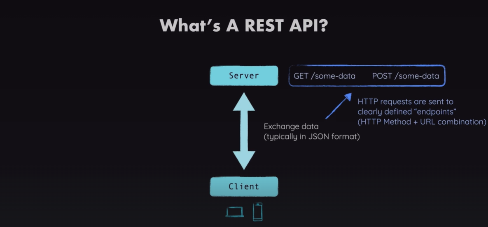
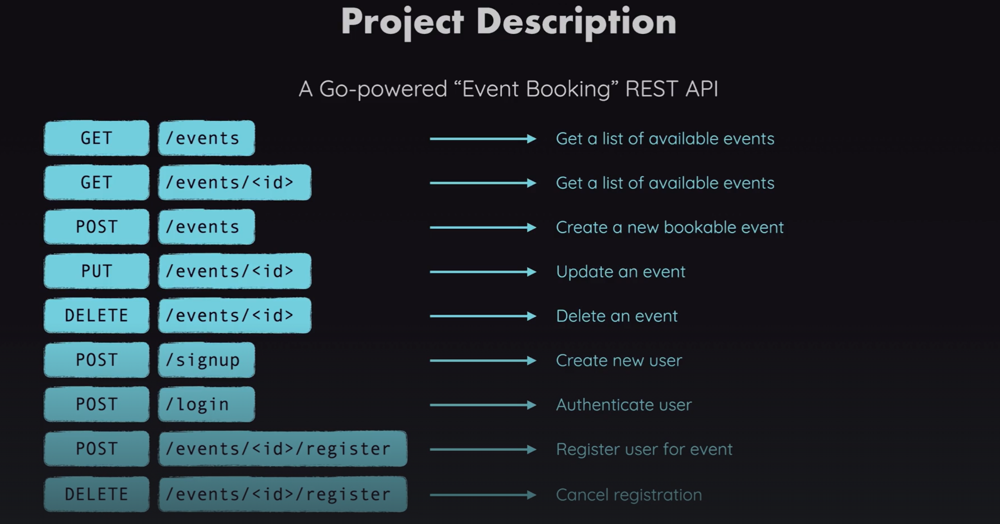
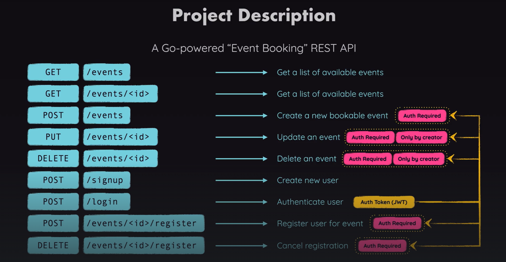
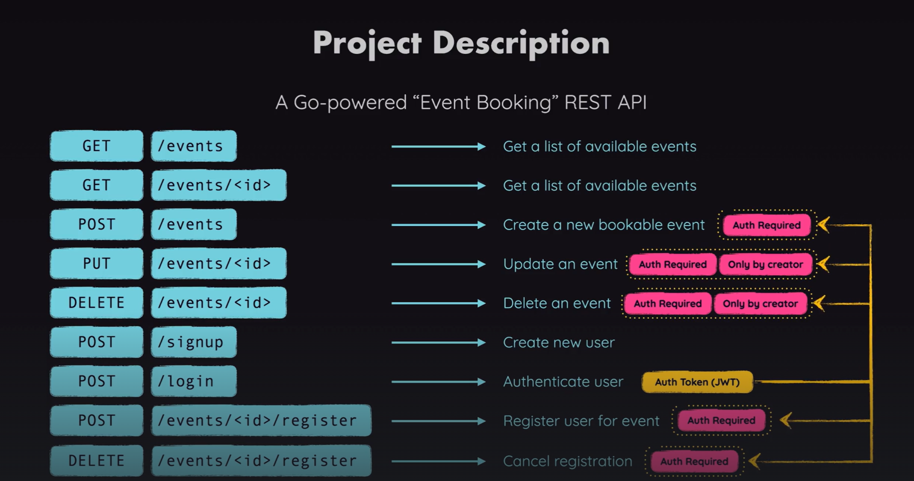

## gin-package: https://github.com/gin-gonic/gin
1. first create a module: git mod init example.com/project
2. go get -u github.com/gin-gonic/gin


## Download sqlite3:
go get github.com/mattn/go-sqlite3

### To use the package:
``` go
package db

import (
	"database/sql" // we will use this package to interact with the database
	_"github.com/mattn/go-sqlite3" // it must be imported, but will not be used directly, go will use it under the hood
)
```
* underscore tells that we will not use it directly.

## to install a package for password hashing:
> go get -u golang.org/x/crypto

# JWT
* Is A string generated by the server when the user successfully login, that proves that the user is logged in. Then sent back from server to client.
* It must be sent with client side requests to prove that the sender is logged in (Authinticated).
* 

** https://github.com/golang-jwt/jwt **
> This is a package that must be installed
> command: go get -u github.com/golang-jwt/jwt/v5