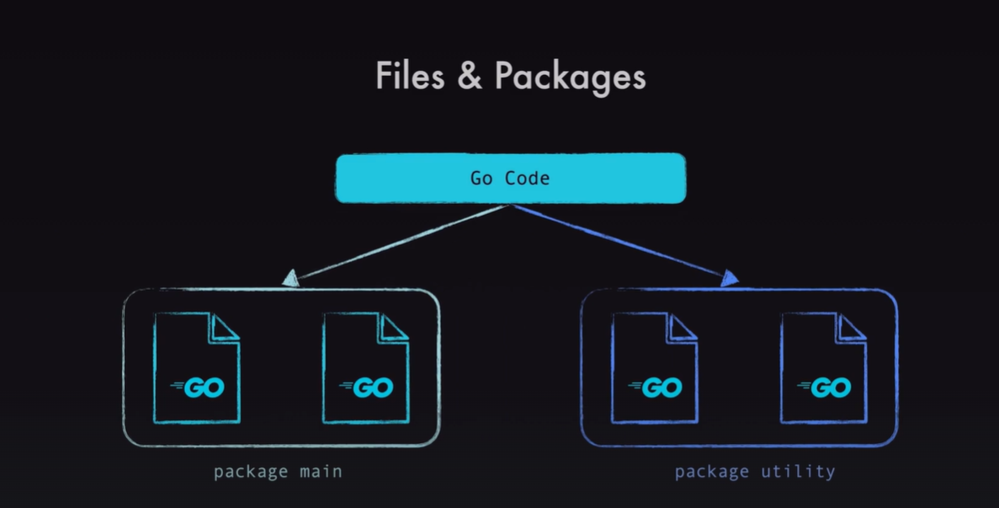

1- to run a '.go' file: go run 'filename'.go.
2- to create a module(project): go mod init 'example.com/first-app'. this tells go that this current folder and all subfolders bleong to this module
3- To build the module: go build
4- to run the module: ./first-app

1- a module can have multiple packages. Each package can have multiple files.
2- 

1- 'package main': tells go where execution should start.
2- 'main function': so GO know where your program starts.
3- creating another file for the same package 'main' can't contain a 'main' function.
